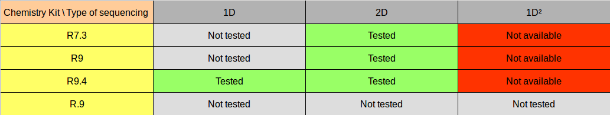
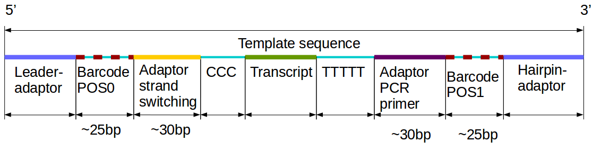
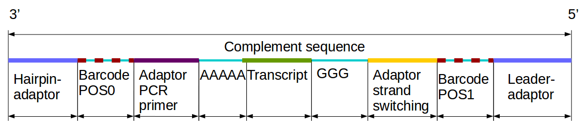
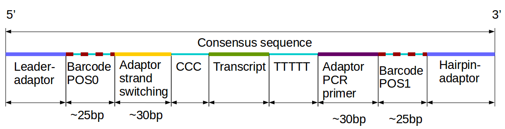
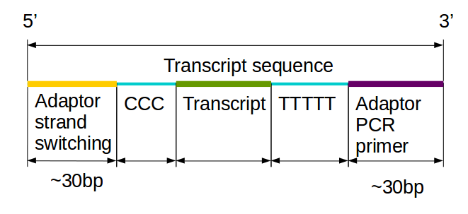
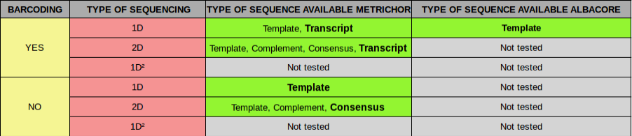

Toullig 0.2-alpha
=======

Toullig is (since January 17 2017) a reader, parser of Fast5 files of ONT (basecalled and not basecalled) and a '.fastq' files writer.
The 01 March Toullig can trim fastq of ONT based on the RT adaptors.

# Author

Aurélien Birer, [birer@biologie.ens.fr](birer@biologie.ens.fr)

# Table of contents

* [Requirements](#Requirements)
* [Installation](#Installation)
    * [To install Maven](#To-install-Maven)
    * [To install Toullig](#To install Toullig)
* [General options](#General options)
* [How it works](#How it works)
    * [Old classification MinION run with Metrichor (MinKNOW < v1.4.2)](#Old classification MinION run with Metrichor)
    * [New classification MinION run with Albacore (MinKNOW > v1.4.2)](#New classification MinION run with Albacore)
    * [Chemistry available](#Chemistry available)
* [Fast5tofastq](#Fast5tofastq)
    * [Understand the type of sequence](#Understand the type of sequence)
    * [Sequence available for each run configuration](#Sequence available for each run configuration)
    * [Options Fast5tofastq](#Options Fast5tofastq)
    * [Example](#Example)
    * [Log files](#Log files)
        * [logConversionFastq.txt](#logConversionFastq.txt)
        * [logCorruptFast5Files.txt](#logCorruptFast5Files.txt)
        * [logWorkflow.txt](#logWorkflow.txt)
* [TrimFastq](#TrimFastq)
    * [Options TrimFastq](#Options TrimFastq)
    * [Example trim](#Example trim)
* [Development environment](#Development environment)
* [Repository](#Repository)
* [License](#License)

#  Requirements

You just need to have Java 8 and Maven installed on your computer. This alpha version work on Ubuntu (Unix distribution).

# Installation

### To install Maven

    sudo apt-get install maven

### To install Toullig

    git clone https://github.com/GenomicParisCentre/toullig.git
    cd toullig
    mvn clean install

# General options

    #Information

    -help | -h      #display help
    -version        #display version of toullig
    -about          #display information of toullig
    -license        #display license of toullig
    

# How it works

Toullig have 2 tools :

- fast5tofastq : read the rootDirectory of your ONT run after the step of basecalling (metrichor/albacore) and produce a '.fastq' file.
- trim : trim the reads of a ONT fastq with a sam file, based on the RT adaptors.

### Old classification MinION run with Metrichor (MinKNOW < v1.4.2)

>**Not Barcoded Directories Tree**

├── downloads  
│   ├── fail  
│   └── pass  
└── uploaded  

>**Barcoded Directories Tree (with 6 barcode)**

├── downloads  
│   ├── fail  
│   │   └── unclassified  
│   └── pass  
│       ├── BC01  
│       ├── BC02  
│       ├── BC03  
│       ├── BC04  
│       ├── BC05  
│       └── BC06  
└── uploaded  

### New classification MinION run with Albacore (MinKNOW > v1.4.2)

>**Not Barcoded Directories Tree**

├── downloads  
│   ├── fail  
│   └── pass  
└── uploaded  

>**Barcoded Directories Tree (with 6 barcode)**

├── downloads  
│   ├── fail  
│   │   └── unclassified  
│   └── pass  
│       ├── BC01  
│       ├── BC02  
│       ├── BC03  
│       ├── BC04  
│       ├── BC05  
│       └── BC06  
└── uploaded  

### Chemistry available

  

# Fast5tofastq

The module work for Metrichor (now closure) and Albacore basecallers.

In the execution of toullig Fast5tofastq, the program step :

 + List the '.fast5' files.
 + Read a '.fast5' file.
 + Write the sequence(s) in a '.fastq' file.
 + Make some log files.

### Understand the type of sequence

Actually, we use in development Metrichor for the basecalling of our '.fast5' files.

But it's important to understand clearly the type of the 4 fastq sequences (see [Sequence available for each run configuration](#sequence-available-for-each-run-configuration)) give by the basecaller (in our case Metrichor).

The template sequence is the first sequence basecalled, this sequence correspond to the own read sequenced in 1D. This sequence contains section as follow :

  

The complement sequence is the second sequence basecalled (in 2D), this sequence correspond to the reverse of the template sequence. This sequence contains section as follow :

  

/!\ The sequence template and complement can be reverse (it's depends of how the leader-adaptor is fix).

The consensus sequence is the sequence result of the alignment of the template and the complement sequence (in 2D). This sequence contains section as follow :

  

/!\ The consensus sequence can be bases on the template sequence or complement sequence.

The transcript sequence is the sequence result of the consensus sequence (in 2D) with a trim of the barcoded sequence (/!\ barcode can be still). This sequence contains section as follow :

  

/!\ The transcript sequence is only available for barcoded ONT run.

### Sequence available for each run configuration

Here, for each sequencing configuration the sequence available for the fast5tofastq conversion.

In bold, the type of sequencing that it's mostly interesting.

  

### Options Fast5tofastq

    
    #Options
    
    -status pass|fail|unclassified (default: pass)                                  # The status of '.fast5' file
    -type template|complement|consensus|transcript (default: transcript)            # The type of sequence
    -mergeSequence true|false (default: false)                                      # If you want merge all type of sequence whatever the status
    -compress GZIP|BZIP2 (default: none)                                            # Set the type of compression for the output '.fastq' files
    
    #Arguments

    -rootDirectoryFast5run /home/user/yourRootDirectoryFast5run
    -outputDirectoryFastq /home/user/yourOutputDirectoryFastq
    
    

### Example

I have a directory of a MinION run in 2D barcoded.
If i want just get the fastq sequence of the 'template', the 'complement' and the 'consensus' for the fast5 files in the status/repertory 'fail'.

    bash ./target/dist/toullig-0.2-alpha/toullig.sh fast5tofastq -status fail -type template,complement,consensus /home/user/myRootDirectoryFast5run /home/user/myOutputDirectoryFastq
    
I have a directory of a minION run in 2D not barcoded.
If i want just get the fastq default sequence for the fast5 files in the status/repertory 'pass'.

    bash ./target/dist/toullig-0.2-alpha/toullig.sh fast5tofastq -status pass /home/user/myRootDirectoryFast5run /home/user/myOutputDirectoryFastq

WARNING : This last example is a trap ! The default type of sequence is transcript or the run is not barcoded and the transcript sequence is not available on ONT barcoded run (see [Sequence available for each run configuration](#sequence-available-for-each-run-configuration)).

### Log files

#### logConversionFastq.txt

This log contains the main informations about the execution of the conversion of '.fast5' files to a the '.fastq' files. The file is structured in 4 sections:

    - The date of the begin of the conversion execution.
    - The number of files reads for each folder create after the basecalling.
    - The number of sequences writes in the fastq and the number of sequences null (not write).
    - The date of the end of the conversion execution.

#### logCorruptFast5Files.txt

This log contains a list of path of corrupt '.fast5' files. Theses files can be read and information can be extract but the HDF5 library use for opening theses files detect a corruption.

#### logWorkflow.txt

This log contains the final status of each basecalling workflow for each folder create after the basecalling.

# TrimFastq

In the case of cDNA protocols like SQK-MAP006.
One of the problem of the MinION reads in the format fastq is that the read is not the transcript as we expected. The read still have the RT adaptor and, in some case, the barcode with sequencing adaptors (leader/hairpin).

For find the truely position of the start/stop of the mRNA, it's important to trim the reads to delete these unwanted sequences.

In the execution of toullig Trim, the program step :

 + Mark the index between the outliers and the mRNA (mode P (Perfect) or SW (Side-Window) ).
 
 For Cutadapt:
 
 + Write '.fasta' file for each outlier.
 + Trim with Cutadapt
 + Write the Cutadapt output merged in a '.fastq' file.
 
  For Trimmomatic:
 
 + Read a fastq sequence.
 + Trim with Trimmomatic.
 + Write the sequence trimmed into a '.fastq' file.

### Options TrimFastq

    
    #Options
    
    -trimmer cutadapt|trimmomatic|no (default: cutadapt)    # The trimmer tool use for trimming or not
    -mode P | SW (default: P)                               # The type of trimming the transcripts reads
    -stats true|flase (default: false)                      # If you want some statistical information on the Cutadapt trimming
    
    #Options Trimming by Side-window mode
    
    -addIndexOutlier (default: 15)                         # A addition of bases of the outlier to have a better catch of the adaptor
    
    #Options Trimming by Side-window mode
    
    -thresholdSideWindow (default: 0.8)                     # The threshold for the Side-Window algorithm
    -lengthWindowsSW (default: 15)                          # The length for the the Side-Window algorithm
    
    #Options Cutadapt
    
    -errorRateCutadapt (default: 0.5)                       # The error rate for Cutadapt (mismatch + deletion)
    
    #Options Trimmomatic
    
    -seedMismatchesTrimmomatic (default:17 )                # The number base of mismatchs maximun for Trimmomatic
    -palindromeClipThresholdTrimmomatic (default: 30)       # The threshold of palindrome clip for Trimmomatic
    -simpleClipThreshold (default: 7)                       # The threshold of simple clip for Trimmomatic
    
    #Arguments
    
    -samFile            /home/user/yourSamFile
    -fastqFile          /home/user/yourFastqFile
    -fastqOutputFile    /home/user/yourFastqTrimOutput
    -adaptorFile        /home/user/yourAdaptorFile
    -workDir            /home/user/yourTmpRepertoryOfWork

### Example trim

    bash ./target/dist/toullig-0.2-alpha/toullig.sh trim /home/user/samFile.sam /home/user/fastqONTFile.fastq /home/user/myFastqTrim.fastq ~/toullig/config_files/adaptor_RT_sequence_modify_for_nanopore.txt /home/user/yourTmpRepertoryOfWork

# Development environment

Ubuntu version: '16.04.4'

Java version: '1.8.0_121'

Maven version: '3.2.3'

# Repository

Currently the Git reference repository is [https://github.com/GenomicParisCentre/toullig](https://github.com/GenomicParisCentre/toullig).

# License

[GNU General Public License, version 3](https://www.gnu.org/licenses/gpl-3.0.html)
[CeCILL](http://www.cecill.info/licences/Licence_CeCILL_V1.1-US.html)

